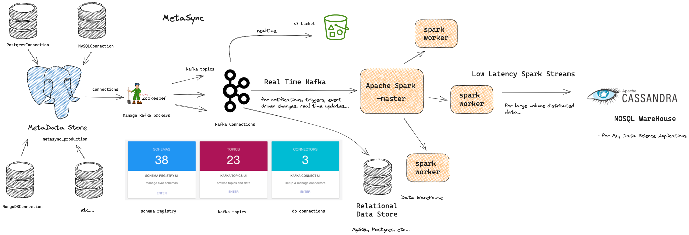

# MetaSync

MetaSync is a tool that allows real time data ingestion, supports a wide variety of Databases for extracting metadata.

https://github.com/VaibhavUpreti/MetaSync/assets/85568177/ed51645a-b98f-4c4e-bbd0-a12a4b62aeb9

Hosted at:

- [MetaSync](http://cv.vaibhavupreti.me:3000)
- [KDE Dashboard (by lenses.io - Schematics, topics, connections)](http://cv.vaibhavupreti.me:3030)
- [Kafka Connect API](http://cv.vaibhavupreti.me:8083)

If any service is down or unreachable, please contact Vaibhav Upreti at vaibhav.upreti16@gmail.com.

Note: SSL is not configured as it is hosted on a VPS behind a pfSense firewall at my university, and DNS is disabled, so the service may be slow.

## Architecture

## ETL Data Pipeline

Metasync, real-time data synchronization tool provides best practices to ensure efficient and secure data synchronization.

- **Low Latency**: Metasync ensures minimal data synchronization latency, guaranteeing real-time updates.

- **Scalability**: Built to scale effortlessly as data volumes grow, accommodating increased demand.

- **Resilience**:  Metasync checks fault tolerance, ensuring uninterrupted data synchronization in the face of failures or disruptions.
