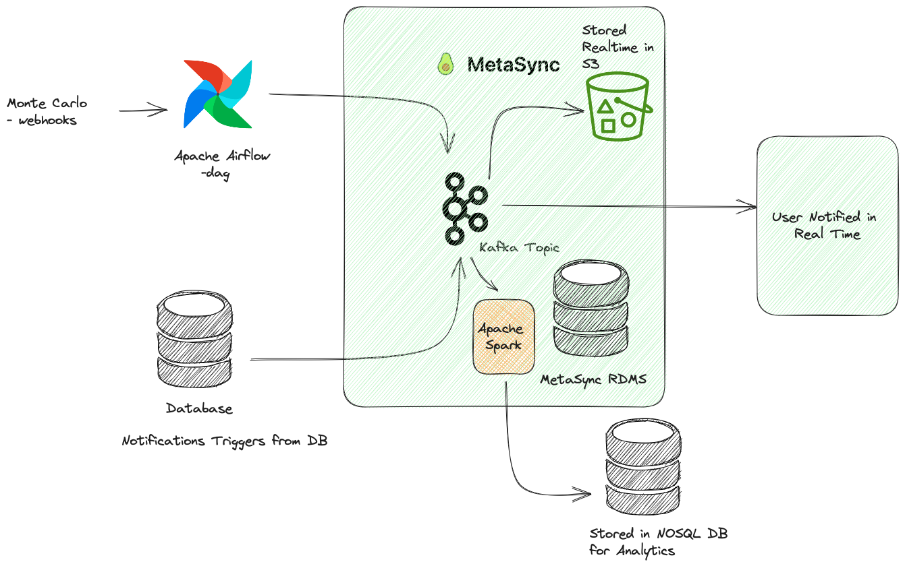

# MetaSync

MetaSync is a tool that allows real time data ingestion, supports a wide variety of Databases for extracting metadata.

https://github.com/VaibhavUpreti/MetaSync/assets/85568177/977801fa-1fd3-4afa-bfe0-e1cdd0c0fda5

## Architecture

## ETL Data Pipeline

Metasync, a real-time data synchronization system, comes with its own set of best practices to ensure efficient and secure data synchronization.

- **Low Latency**: Metasync ensures minimal data synchronization latency, guaranteeing real-time updates.

- **Scalability**: Built to scale effortlessly as data volumes grow, accommodating increased demand.

- **Resilience**:  Metasync checks fault tolerance, ensuring uninterrupted data synchronization in the face of failures or disruptions.

## Applications

### 1. **(INBOUND, EXTERNAL)**: Real Time Notifications

> A customer uses Monte Carlo as a tool for data observability. They have set it up so that Monte Carlo catches any table health or data reliability issues early on. The customer would like Atlan to also become a near-real-time repository of such issues, with relevant metadata attached to respective assets.

**Real Time Kafka Streams**

https://github.com/VaibhavUpreti/MetaSync/assets/85568177/b2d25975-946c-41c2-9b30-77d8621b9249

### 2. **(INBOUND, INTERNAL)**: Gradual Normalization of Metadata with Schema Mappings

> A prospect has a metadata estate spanning 1B metadata assets. While the bulk of this payload is columns in different tables and BI fields (~90% of total), the remaining 10% consists of assets such as databases, schemas, tables, and dashboards. They want to ingest metadata using Atlan’s metadata extraction with an 80-20 rule, where columns become eventually consistent in the metadata lake.

Metasync leverages a robust architecture and a range of cutting-edge technologies to provide a comprehensive solution to this problem:

Real-time Data Ingestion: Metasync employs Kafka topics to enable real-time data ingestion from the source database. This ensures that any updates or changes in the metadata estate are promptly captured and processed.

Storage in S3 and RDBMS: The ingested metadata is seamlessly stored in both Amazon S3 and a Relational Database Management System (RDBMS). Storing the data in S3 provides a scalable, cost-effective, and durable storage solution, while the RDBMS enables structured storage and query capabilities.

Spark Streaming: Metasync incorporates Apache Spark for stream processing. Spark Streaming processes data in micro-batches, ensuring low-latency and high-throughput processing of metadata updates. This processing can include data validation, transformation, and enrichment.

Data Flow to NoSQL Cassandra Database: Metasync effectively routes the processed metadata to a NoSQL Cassandra database. Cassandra is chosen for its ability to handle high write loads and provide near real-time access to the ingested metadata. This choice is particularly suitable for use cases involving time-series data or scenarios where eventual consistency is acceptable.

Metadata Transformation and Normalization: Metasync incorporates a set of transformation and normalization processes. These processes are responsible for converting the incoming metadata from its source format to a standardized and normalized format as per the 80-20 rule and other defined business rules. The transformation and normalization steps may include:

Data Standardization: Metasync applies data standardization rules to ensure consistency across various data sources. This involves mapping different data representations to a common schema or taxonomy.

Schema Mapping: The platform facilitates the mapping of different schema structures to a unified schema, ensuring that metadata assets are organized and described consistently.

Metadata Enrichment: Metasync can enrich metadata by adding relevant information or annotations, making it more informative and valuable for users.

Data Validation: Data validation rules can be applied to ensure that the metadata meets quality and integrity standards. Invalid or inconsistent data can be flagged for further action.

Normalization of Data Types: If the source metadata includes a variety of data types, Metasync can normalize them to a common set of data types as per the defined standards.

These transformation and normalization processes ensure that the metadata estate is not only ingested in real-time but also structured and organized in a standardized and consistent manner. By applying these steps, Metasync helps organizations maintain data quality and integrity while adhering to the 80-20 rule and any other specific requirements for their metadata estate.

### 3. **(OUTBOUND, INTERNAL)**: 

> There are internal enrichment automation requirements towards metadata into Atlan, such that any change in the Atlan entity triggers similar changes to entities connected downstream in lineage from that entity.

- **(OUTBOUND, EXTERNAL)** : A customer of Atlan wants to enforce data access security and compliance. They require that as soon as an entity is annotated as PII or GDPR in Atlan, their downstream data tools become aware of it and enforce access control while running SQL queries on the data.

There are many more use-cases similar in nature, where real-time behavior of the Atlan platform is essential. The Atlan team has realized the importance of supporting such capabilities as part of their platform.

Your task is to create an architecture that supports the above use cases, . You will need to consider the following aspects as you solve the problem statement:

## Features

### Real Time Ingestion and Consumption

### Schematics When Ingesting and Consuming Metadata

### MetaDataStore

MetaSync Stores some User data in postgres DB `metasync_production` for mkaing connections to kafka and necessary adapters from where data is drawn from in real time.

Which allows storing MetaData later to S3 and NOSQL DB such as Cassandra

### Authentication & MultiTenancy

** Authentication:

** MultiTenancy:

### Pre Ingest & Post Consume Transformations Support

### Scalability

Horzitonally as well vertically.

### Infrastructure

- Kafka Worker

- Spark Master and workers

- Observability tools:

### Observability 

- Prometheus & Grafana: To Monitor Health of Platform.

- Distributed Tracing(OpenTelemetry): To find slow points and take actions.

[Distributed Tracing](https://vaibhavupreti.me/blog/distributed-tracing-opentelemetry/)

## Future Prospects

- Relase in a plugin fashion
