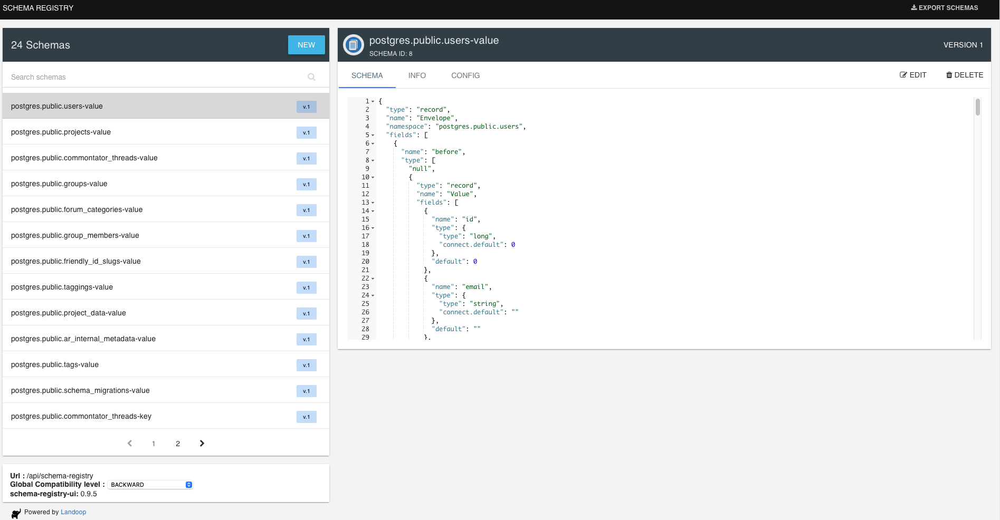
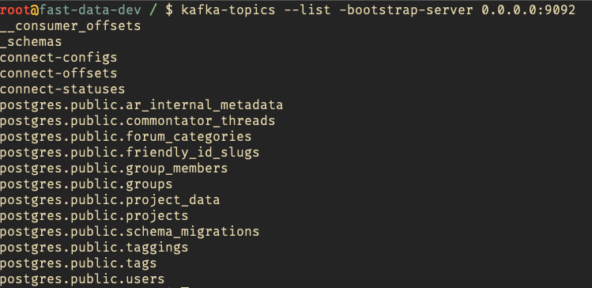

# MetaSync

MetaSync is a tool that allows real time data ingestion, supports a wide variety of Databases for extracting metadata.

https://github.com/VaibhavUpreti/MetaSync/assets/85568177/ed51645a-b98f-4c4e-bbd0-a12a4b62aeb9

## Architecture

## ETL Data Pipeline

Metasync, real-time data synchronization tool provides best practices to ensure efficient and secure data synchronization.

- **Low Latency**: Metasync ensures minimal data synchronization latency, guaranteeing real-time updates.

- **Scalability**: Built to scale effortlessly as data volumes grow, accommodating increased demand.

- **Resilience**:  Metasync checks fault tolerance, ensuring uninterrupted data synchronization in the face of failures or disruptions.

## Applications

### 1. **(INBOUND, EXTERNAL)**: Real Time Notifications

> A customer uses Monte Carlo as a tool for data observability. They have set it up so that Monte Carlo catches any table health or data reliability issues early on. The customer would like Atlan to also become a near-real-time repository of such issues, with relevant metadata attached to respective assets.

**Real Time Kafka Streams**

https://github.com/VaibhavUpreti/MetaSync/assets/85568177/27c8954d-9cb5-4c1d-b452-e509ea5926ab

### 2. **(INBOUND, INTERNAL)**: Gradual Normalization of Metadata with Schema Mappings

> A prospect has a metadata estate spanning 1B metadata assets. While the bulk of this payload is columns in different tables and BI fields (~90% of total), the remaining 10% consists of assets such as databases, schemas, tables, and dashboards. They want to ingest metadata using Atlan’s metadata extraction with an 80-20 rule, where columns become eventually consistent in the metadata lake.

**Schematics**

- Real-time Data Ingestion:  Kafka topics to enable real-time data ingestion from the source database. This ensures that any updates or changes in the metadata estate are promptly captured and processed.

- Storage in S3 and RDBMS: The ingested metadata is seamlessly stored in  Amazon S3 and a Relational Database Management System (RDBMS). Storing the data in S3 provides a scalable, cost-effective, and durable storage solution, while the RDBMS enables structured storage and query capabilities.

- Spark Streaming: Metasync incorporates Apache Spark for stream processing. Spark Streaming processes data in micro-batches, ensuring low-latency and high-throughput processing of metadata updates. This processing can include data validation, transformation, and enrichment.

- Data Flow to NoSQL Cassandra Database: Metasync effectively routes the processed metadata to a NoSQL Cassandra database. Cassandra is chosen for its ability to handle high write loads and provide near real-time access to the ingested metadata. This choice is particularly suitable for use cases involving time-series data or scenarios where eventual consistency is acceptable.

- Metasync captures and stores the before and after configurations of each query which allow consistent normalization of metadata. A set of transformation and normalization processes can be applied using custom ETL data pipelines to
convert the incoming metadata from its source format to a standardized and normalized format as per the 80-20 rule and other defined business rules.

The transformation and normalization steps may include anything from:

- Data Standardization: Metasync applies data standardization rules to ensure consistency across various data sources. This involves mapping different data representations to a common schema or taxonomy.

- Schema Mapping: The platform facilitates the mapping of different schema structures to a unified schema, ensuring that metadata assets are organized and described consistently.

- Metadata Enrichment: Metasync can enrich metadata by adding relevant information or annotations, making it more informative and valuable for users.

- Data Validation: Data validation rules can be applied to ensure that the metadata meets quality and integrity standards. Invalid or inconsistent data can be flagged for further action.

These transformation and normalization processes would ensure that the metadata estate is not only ingested in real-time but also structured and organized in a standardized and consistent manner.
By applying these steps, Metasync helps organizations maintain data quality and integrity while adhering to the 80-20 rule and any other specific requirements for their metadata estate.

### 3. **(OUTBOUND, INTERNAL)**: Internal Metadata Enrichment with Kafka, Apache Spark, and Cassandra

> There are internal enrichment automation requirements towards metadata into Atlan, such that any change in the Atlan entity triggers similar changes to entities connected downstream in lineage from that entity.

- Kafka for Real-time Event Streaming: Kafka cluster to capture events and changes in the Atlan platform, ensuring that all entity changes are published as events.

**Subscribed Kafka topics**

- Apache Spark for Stream Processing: Apache Spark's Structured Streaming then  consume data from Kafka topics and process the metadata changes in real-time. Spark allows for complex transformations and joins.

- Enrichment Logic: Implement custom enrichment logic to process the metadata changes, ensuring that downstream entities are updated accordingly. This might involve parsing, transformation, and validation. Hence various ETL pipelines can be incorporated.

-  Metadata Storage: Store the metadata and lineage information in S3, Cassandra(optimized for fast writes and real-time data access) and any RDBMS support can be added too.

- Automated Updates: Database transactions trigger updates to downstream entities based on the changes in metadata hence ensure that changes are propagated efficiently to maintain data integrity.

### 4. **(OUTBOUND, EXTERNAL)** : External Data Access Security with Kafka, Apache Spark, and S3

> A customer of Atlan wants to enforce data access security and compliance. They require that as soon as an entity is annotated as PII or GDPR in Atlan, their downstream data tools become aware of it and enforce access control while running SQL queries on the data.

- Kafka topics can capture and publish data annotation events when entities are marked as PII or GDPR in Atlan.

Metasync uses internal `metasync_production` postgres DB to store user details, this ensures that user can acquire locks on transactions and excercise access control

- Store annotated data and access control policies in an S3 data lake, making it accessible to downstream tools while maintaining a secure and auditable data repository.

## Features

### Real Time Ingestion and Consumption
Implement real-time data pipelines for ingestion and consumption. Technologies like Apache Kafka or Apache Pulsar can be used to handle real-time data streams.
Ensure that your ingestion and consumption processes are designed to handle high throughput and low latency. Use technologies such as Apache Flink or Apache Spark Streaming for stream processing.
Implement data connectors and adapters to support various sources and sinks for metadata.

### Schematics When Ingesting and Consuming Metadata
Handle schema evolution in Kafka topics gracefully to ensure backward and forward compatibility as metadata structures change over time.
Implement Avro or Protocol Buffers for message serialization to facilitate schema evolution and compatibility.
Use the schema registry to manage and validate schema changes to prevent issues in message processing.

JSON outputs of before and after stored in S3, 

### MetaDataStore

MetaSync Stores some User data in postgres DB `metasync_production` for mkaing connections to kafka and necessary adapters from where data is drawn from in real time.

Which allows storing MetaData later to S3 and NOSQL DB such as Cassandra
Select a suitable metadata store to handle the volume and velocity of metadata. Consider databases like Apache Cassandra or Elasticsearch for scalable storage.
Model your metadata to accommodate the different asset types and their relationships. Use appropriate data modeling techniques to represent metadata entities effectively.

### Authentication & MultiTenancy

** Authentication:
Ensure that access control is enforced at both metadata and data levels. Access control policies should be enforced during SQL queries and data access.

** MultiTenancy:
allowing different customers to deploy and use the platform in isolation.
Implement resource isolation, access control, and secure data segregation for each tenant.
Use Kubernetes or container orchestration to manage tenant-specific deployments.

### Pre Ingest & Post Consume Transformations Support
Build a transformation layer in your data pipelines that allows for pre-ingest and post-consume transformations when necessary.
Use technologies like Apache Beam or Apache Nifi for data transformation and enrichment.
Define transformation rules and workflows based on metadata attributes and requirements.

### Scalability

1. Kafka Scalability:

- Horizontal Scalability: Kafka is designed for horizontal scalability. 
You can add more Kafka brokers to distribute the load, increase throughput, and store larger amounts of data. This scaling is typically achieved by adding more servers to the Kafka cluster.

- Vertical Scalability: While Kafka primarily scales horizontally, you can also scale individual Kafka brokers vertically by upgrading the hardware (e.g., increasing CPU, memory, or storage capacity) to handle higher throughput and storage requirements.

2. Spark Scalability:

- Horizontal Scalability: Apache Spark can be scaled horizontally by adding more worker nodes to a Spark cluster. An ideal production setup would consist of at least 2 master nodes.
    This allows for the parallel processing of data across a larger number of nodes, improving the processing speed and capacity.

- Vertical Scalability: In some cases, vertical scaling may be beneficial for Spark's driver nodes, especially if complex driver-side operations are a bottleneck. Increasing the CPU and memory resources of the driver nodes can improve performance.

3. MeataData DB Scalability:

- Horizontal Scalability: For databases, horizontal scalability is typically achieved through database sharding or replication. You can shard your database into multiple partitions, with each shard residing on a separate server. Alternatively, you can use replication to create read replicas, distributing read workloads across multiple nodes.

- Vertical Scalability: Vertical scalability for databases involves upgrading the hardware resources of individual database servers, such as increasing CPU, RAM, and storage capacity. Vertical scaling can help handle increased database write operations and complex queries.

## Infrastructure

**Kafka(topics, schema registry, streams)**

- Plays pivotal role in real-time data processing

**Spark Master and workers**

- 

**Observability tools**

-  Prometheus, Grafana: To track the ingestion rate,monitoring metrics related to data consistency, errors, system health, Query performance. Visualize using Grafana

-  Distributed Tracing(OpenTelemetry): Trace requests from ingrestion to consumption to identify slow points and bottlenecks in the ETL data processing pipeline.

## Observability 

**Prometheus & Grafana:**

- To track the ingestion rate, data reliability, and query performance.

**Distributed Tracing(OpenTelemetry):**

- OpenTelemetry to trace the path of data from ingestion to consumption, allowing find slow points and bottlenecks [Vaibhav Upreti's Blog](https://vaibhavupreti.me/blog/distributed-tracing-opentelemetry/)

##  Alternatives Considered

- Rabbit MQ for messaging queues
- AWS Lambda functions to fetch real time data
 
## Future Prospects

- Relase in a plugin fashion
- Implement Horizontal Pod Autoscaling for MetaSync. 
